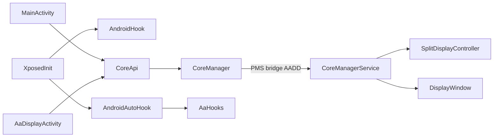

# AGENTS.md — AADisplay

面向后续 AI / 开发者的项目地图与改动约束。改代码前先建立心智模型，避免误动隐藏 API、Binder 桥、Android Auto DexKit 钩子等高风险区域。

## 1. 项目概述

AADisplay 是 [Nitsuya/AADisplay](https://github.com/Nitsuya/AADisplay) 的生产向 fork：通过 **LSPosed** 在系统侧创建 **VirtualDisplay**，把选定手机应用投到 **Android Auto** 车机界面，并提供手机端悬浮控制与 AA 侧 UI/DPI/按键等兼容钩子。

| 项 | 说明 |
|----|------|
| 平台 | 仅 Android 手机 + Android Auto（无 iOS / Web / Desktop） |
| 最低系统 | Android 12+（`minSdk 31`），`compileSdk` / `targetSdk` 36 |
| 运行前提 | Root + LSPosed（或兼容 Xposed）；至少勾选 System Framework + Android Auto |
| AA 包名 | `com.google.android.projection.gearhead` |
| 许可证 | GPLv3（见 `LICENSE`） |
| 版本号 | `0.24#<AA版本>-rN`（以 `aa-display/build.gradle.kts` 的 `versionName` / `versionCode` 为准；README 可能滞后） |

本仓库 **无 CI、无有效自动化测试**；真机 + LSPosed + Android Auto 联调是主验证方式。

## 2. 仓库地图

| 路径 | 用途 |
|------|------|
| `aa-display/` | 主 APK / Xposed 模块（UI、钩子、AIDL、服务） |
| `aa-display/libs/` | 本地二进制：`aauto.aar`（Car SDK）、Xposed API jar — **勿随意替换** |
| `aa-display/src/main/assets/xposed_init` | Xposed 入口类名 |
| `aa-display/src/main/aidl/` | Binder 接口与 parcelable 模型 |
| `lib-stub/` | 隐藏 Framework API 的 Rikka Refine stubs（`compileOnly`） |
| `CHANGELOG.md` / `RELEASE_NOTES_*` | 行为变更与真机验证记录 |
| `settings.gradle.kts` | 仅 `:aa-display`、`:lib-stub` |

### 主包结构（`io.github.nitsuya.aa.display`）

| 目录 | 职责 |
|------|------|
| `xposed/` | `XposedInit`、Binder 桥、`CoreManager` / `CoreManagerService` |
| `xposed/hook/` | 系统 / 通用钩子 |
| `xposed/hook/aa/` | Android Auto 专用钩子（`Aa*Hook`） |
| `ui/main/` | 手机端激活状态页（`MainActivity`，`CATEGORY_INFO`；无桌面图标，经 LSPosed 打开） |
| `ui/aa/` | 车机投影 Activity / Fragment / VirtualDisplay 适配 |
| `ui/window/` | 手机端悬浮窗与任务列表（`SHOW_PHONE_OVERLAY=false` 时 UI 关闭，会话策略仍跑） |
| `service/` | `AaActivityService` |
| `util/` | `LastSplitStore`、广播常量、触控改写等 |
| `model/` | 最近任务等模型 |

Vendored 基座（**非必要不改**）：

- `io.github.duzhaokun123.template` — UI 基类 / ViewBinding 工具
- `io.github.qauxv` — `Initiator`、`CommonContextWrapper` 等

## 3. 架构与关键入口



### Xposed 入口与路由

- 入口：`aa-display/src/main/assets/xposed_init` → `io.github.nitsuya.aa.display.xposed.XposedInit`
- `handleLoadPackage` 路由（见 `XposedInit.kt`）：

| 条件 | Hook |
|------|------|
| `packageName == "android"` 且 `appInfo == null` | `AndroidHook`（system_server：VirtualDisplay、Binder 桥等） |
| `com.google.android.projection.gearhead` | `AndroidAutoHook`（再按进程分发 `Aa*Hook`） |
| 其余包 | 不注入钩子 |

`AndroidAutoHook` 进程常量：

- `com.google.android.projection.gearhead`
- `…:projection`
- `…:car`

已注册 AA 钩子：`AaSignatureHook`、`AaBtnEventHook`、`AaUiHook`（按 `isSupportProcess` 过滤；大量依赖 DexKit）。

### 跨进程 IPC

- 门面：`CoreApi`（`Application.kt`）—— 非 system 用 `CoreManager`，uid 1000 用 `CoreManagerService.instance`
- 契约：`ICoreManager.aidl`（创建/销毁显示、Surface、启停任务、按键/触摸、最近任务）
- 桥接：`AndroidHook` 注入 `IPackageManager.onTransact`，magic code **`AADD`**，把 `CoreManagerService` binder 交给应用进程

跨进程显示能力 **必须** 经 `CoreApi` / `ICoreManager`，不要在 AA 或普通 App 进程直接操作 VirtualDisplay。

### 配置

本模块**不再使用** `aadisplay_config` SharedPreferences / XSharedPreferences 镜像。
行为为代码内常量（如 Delay Destroy = 180s、Auto Open / Restore Last Split 始终开启）。
分屏快照仍走 `LastSplitStore`（`Settings.Global` + `/data/system/aadisplay_last_split.properties`），与旧 prefs 无关。
App 进程**不申请 Magisk `su`**（已移除 libsu）；VirtualDisplay 等能力经 Xposed → system_server。

### LSPosed scope

见 `aa-display/src/main/res/values/arrays.xml`：`android`、`gearhead`。改 scope 会影响模块生效范围，勿随意删改。

## 4. 构建与验证

```bash
./gradlew :aa-display:assembleDebug
./gradlew :aa-display:assembleRelease
./gradlew :aa-display:lintDebug
```

| 项 | 说明 |
|----|------|
| 技术栈 | Kotlin 为主 + 少量 Java；AGP / Kotlin / Gradle 以根 `build.gradle.kts` 与 wrapper 为准；Java 11 |
| UI | ViewBinding + Material；**无 Compose**，不要擅自引入 |
| Release 签名 | 环境变量 `KEY_ANDROID` + 根目录 `key.jks`；未设置则回退 debug 签名 |
| 产物名 | `aa-display-${versionName}.apk`（`#` 替换为 `-`） |
| 密钥 | **勿提交** `key.jks` 与密码 |

安装验证流程：

1. 安装 APK
2. LSPosed 启用模块：至少 **System Framework** + **Android Auto**
3. 重启设备
4. 在 LSPosed → AADisplay 打开状态页查看激活状态（无桌面图标）
5. 连接 Android Auto，验证双屏分屏、触控、任务切换、断开后约 180s 延迟销毁

改 AA 钩子后：对照目标 gearhead 版本；确认 DexKit 解析仍命中；查阅 `CHANGELOG.md` / `RELEASE_NOTES_*` 中的稳定性约束（如 display profile lock、TaskView）。

## 5. 编码与改动硬规则

- **最小改动**：只改任务所需文件；不擅自加 Compose、CI、大范围重构或无关文档。
- **语言**：新逻辑优先 Kotlin；Car SDK 路径（如 `AaDisplayActivity`、`AaActivityService`）可保持 Java。
- **新钩子**：`object` 继承 `BaseHook` / `AaHook`；`tagName` 使用 `AAD_*` 前缀；日志标签沿用 `AADisplay_*` / `AAD_*`。
- **禁止随意重命名**（跨进程 / 对外契约）：
  - Binder magic `AADD`
  - `ICoreManager` / 其它 AIDL 方法签名与 parcelable
  - `xposed_scope` 数组项（除非明确要扩展作用域）
  - `LastSplitStore` 持久化 key 名（已有设备上的 snapshot）
- **隐藏 API**：变更走 `lib-stub` + Rikka Refine；勿在主模块硬编码未 stub 的 framework 类。
- **混淆**：ProGuard 已 keep `io.github.nitsuya.aa.display.**`；新增反射 / Xposed 目标仍需评估 AA 版本与混淆差异。
- **资源 package id**：工程保留 `0x64`（Xposed 友好），勿随意改。
- **Vendored 包**：`template` / `qauxv` 非必要不改。

## 6. 按场景的改动指引

### 行为常量（勿再加 prefs UI）

需要可调行为时优先用代码常量或 `LastSplitStore`；不要重新引入 `aadisplay_config` SharedPreferences 管线。

### 新增 / 调整 AA 行为钩子

1. 实现放在 `xposed/hook/aa/`
2. 在 `AndroidAutoHook` 的 hooks 列表中注册，并正确实现 `isSupportProcess`
3. 优先 DexKit / 动态解析，避免写死易碎偏移或字段名
4. 在目标 AA 版本真机验证；失败时看 `AAD_*` 日志与 DexKit 初始化是否成功

### 显示尺寸 / 生命周期

优先阅读：

- `xposed/CoreManagerService.kt`
- `ui/aa/split/SplitDisplayController.kt`（双 VD 创建 / 分屏 / Surface / 任务）
- `ui/aa/fragment/AaMainFragment.kt`（Surface / touch / 分屏 UI）

注意 CHANGELOG 中的 **display profile lock**、固定 **Delay Destroy = 180s**、TaskView 稳定性相关行为，避免重引入重连闪烁或过早销毁。

### 手机悬浮控制

- `ui/window/DisplayWindow.kt`（`SHOW_PHONE_OVERLAY` 默认 `false`：不显示悬浮 UI，仍跑 Delay Destroy / keep-awake）
- 通过 `CoreApi` 操作任务，不直接碰 system VirtualDisplay

### 车机 Recent 任务列

- `ui/aa/fragment/AaRecentTaskFragment.kt`、`ui/aa/recent/`（`RecentTaskColumns` / `RecentTaskColumnAdapter`）
- 入口：分屏分隔条长按 → `AaDisplayActivityKt.showRecentTask`

### 扩展 IPC

1. 先改 `ICoreManager.aidl`（及必要 model AIDL）
2. 同步实现 `CoreManagerService` 与 `CoreManager` 客户端
3. UI / Hook 只经 `CoreApi` 调用

## 7. 安全与合规边界

- 本模块含 `AaSignatureHook` 等 **Android Auto 兼容** 逻辑；修改须说明兼容目的，不扩展为通用恶意签名绕过或无关攻击能力。
- 不提交 `key.jks`、密钥、含隐私的用户设备日志。
- 新增依赖须兼容 **GPLv3**。
- 不添加与任务无关的遥测 / 后门 / 未说明的网络上报。

## 8. 快速查阅索引

| 需求 | 从这里开始 |
|------|------------|
| Xposed 入口 / 包路由 | `xposed/XposedInit.kt` |
| 系统 VirtualDisplay / Binder 桥 | `xposed/hook/AndroidHook.kt`、`CoreManagerService.kt` |
| AA 钩子总控 | `xposed/hook/AndroidAutoHook.kt` |
| 车机画面与触控 | `ui/aa/AaDisplayActivity*.java/kt`、`AaMainFragment.kt` |
| 手机状态页（LSPosed 打开） | `ui/main/MainActivity.kt` |
| 分屏快照 | `util/LastSplitStore.kt` |
| IPC 契约 | `aidl/.../ICoreManager.aidl` |
| 隐藏 API stubs | `lib-stub/` |
| 作用域 | `res/values/arrays.xml` |
| 版本号 | `aa-display/build.gradle.kts` |
