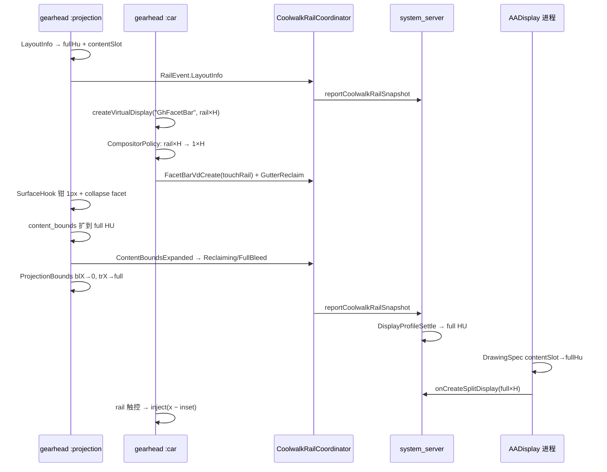

# COOLWALK_FACETBAR.md — FacetBar / 左轨回收与重连分辨率

Coolwalk 左侧 **FacetBar**（`GhFacetBar` VirtualDisplay + launcher/dashboard 图标列）与 **重连分辨率结算** 的架构说明。  
运行时总链路见 [EXECUTION.md](EXECUTION.md)；仓库地图见 [AGENTS.md](../AGENTS.md)。

---

## 1. 问题背景

Android Auto Coolwalk 在 HU 左侧保留一条 **竖向导航轨**（FacetBar）：

| 层 | AA 原生表现 | AADisplay 目标 |
|----|-------------|----------------|
| **Compositor** | 具名 `GhFacetBar` VirtualDisplay，宽约 80–107px | **饿成 1×H**，合成器不再占槽 |
| **Compositor 窗几何** | `{blX=rail, trX=fullHU}`，slot 宽 = full − rail | `blX→0`，`trX→fullHU` |
| **Layout** | `content_bounds` = `Rect(rail,0,HU−rail,H)` | 扩成 `Rect(0,0,fullHU,H)` |
| **View** | `gh_coolwalk_*facet*` 图标列 | GONE + 0 宽，兄弟内容 MATCH_PARENT |
| **Profile** | 分屏 VD 按 content slot 创建（如 720、1828） | 回收后按 **full HU** settle（800、1920…） |
| **Presentation** | `DrawingSpec` 宽 = content slot | 加宽到 full HU |
| `x < rail` 且 **应用选择器 / Recent 打开** | `touchAaDisplay`，**不减** compositor inset（presentation 已是满 HU；减 inset 会让左侧点偏/点不到） |
| `x < rail` 且全屏 peel 命中带 | `touchAaDisplay`，减 compositor inset（§10.11） |
| 其余 `x < rail` | `touchPrimaryPane` / 可见全屏 pane，减 inset |

各层不同步时会出现：**左侧黑条**、**右侧 gutter**、**全屏 peel 条点不动**、**软重连 content/full 来回跳**。

典型数值（均为运行时观测，**无硬编码分辨率表**）：

| HU 示例 | full HU | 轨宽（观测） | content slot | 黑条成因 |
|---------|---------|--------------|--------------|----------|
| 800×480 | 800 | ~80 | 720 | blX=80 未归零 / profile 锁 720 |
| 1280×720 | 1280 | ~107 | 1173 | DrawingSpec 仍 1173 |
| 1920×1080 | 1920 | ~92–107 | 1828 | blX=92 + inject 未减 inset |

---

## 2. 端到端链路概览

### 2.1 进程与职责

```
gearhead :projection                          gearhead :car
├─ CoolwalkFacetBarSurfaceHook  surface 宽钳制   ├─ AaCoolwalkLayoutHook       rail dimen → 0
├─ CoolwalkFacetChrome          视图折叠         ├─ AaCoolwalkCompositorHook   VD starve/expand
├─ AaCoolwalkLayoutHook         LayoutInfo       ├─ CoolwalkFacetChrome        视图折叠
├─ AaCoolwalkProjectionHook     content_bounds   ├─ AaCoolwalkHuTouchHook      HU 触控偷渡
├─ AaCoolwalkCompositorHook     VD policy        ├─ CoolwalkProjectionBoundsHook  blX 归零
├─ CoolwalkProjectionBoundsHook blX 扩展         └─ AaCoolwalkProjectionHook   content_bounds 镜像
└─ CoolwalkRailCoordinator ◄── RailEvent ──► (IPC) system_server
                                              ├─ CoolwalkRailStore (Settings.Global 镜像)
                                              └─ DisplayProfileSettle → profile lock

io.github.nitsuya.aa.display (AADisplay 进程)
└─ AaDisplayProcessHook → CoolwalkDrawingSpecWiden  (DrawingSpec / presentation 加宽)
```

**单一状态源：** gearhead 内所有 FacetBar 相关 hook 只经 `CoolwalkRailCoordinator.onEvent` 读写 `RailSnapshot`，再 `NotifyServer` 到 system_server。不要在各模块私藏 HU 宽度。

### 2.2 典型冷连时序



### 2.3 软重连

gearhead 进程常存活，AA 断连再连时：

1. `AaCoolwalkProjectionHook` 检测 projection config republication → `onProjectionConfigSignal`。
2. 距上次 config > 8s 或 phase 需重置 → `RailEvent.ReconnectStarted`（清空上一车 HU / contentSlot）。
3. **无论是否 reset，reclaim 仍要跑：** `reclaimAllWindowGutters` + `scheduleEnsureFacetBar` + `starveSurvivingFacetBarVds`（250ms / 1s 重试）。
4. `CoolwalkRailStore.markReconnectEpoch` + `SETTINGS_RECONNECT_UPTIME_MS` 供 content_bounds 幂等判断。

---

## 3. 分辨率适配模型（`CoolwalkRailMath`）

**原则：** 不适配「800 / 1280 / 1920」表格，只适配 **三条运行时观测** + **FacetBar 物理 UI 常数**。

### 3.1 三条观测（`RailSnapshot`）

| 字段 | 来源 | 用途 |
|------|------|------|
| `fullHuWidthPx` | LayoutInfo canvas、VirtualDevice、`ContentBoundsExpanded` | 真 HU 宽；DrawingSpec 加宽目标；profile settle |
| `contentSlotWidthPx` | LayoutInfo 窄宽、`rememberContentSlotWidth` | **reclaim 后仍保留**；算 compositor inset；不随 `layoutWidthPx` 晋升而丢失 |
| `touchRailWidthPx` | `FacetBarVdCreate` / VD 观测 | **仅** HU 触控 hit 带宽；**禁止**用于 profile |

辅助字段：

| 字段 | 说明 |
|------|------|
| `layoutWidthPx` | 最近一次 LayoutInfo 宽；`ContentBoundsExpanded` 后可能升为 fullHu |
| `effectiveRailWidthPx` | 目标恒 0（内容/profile 无轨） |
| `facetDisplayId` | 具名 FacetBar VD 的 displayId（触控 CarDisplayId 匹配） |

`contentSlotWidthPx` 生命周期：

- `LayoutInfo`：`rememberContentSlotWidth(width, fullHu, previous)` — 当 `width < fullHu` 时记下 content slot。
- `ContentBoundsExpanded`：`layoutWidthPx` 升为 fullHu，**`contentSlotWidthPx` 不变**（inset 仍可用）。
- `FullBleed` 稳定（`fullBleedStableCount ≥ 3`）：`contentSlotWidthPx → 0`（inset 不再需要）。
- `ReconnectStarted`：整表 `RailSnapshot` 重置。

### 3.2 物理常数（非分辨率特调）

定义于 `CoolwalkRailMath`：

| 常数 | 值 | 含义 |
|------|-----|------|
| `absoluteFacetRailBand()` | 32..160 px | Coolwalk 竖轨物理宽度带（各 HU 同一套 chrome） |
| `RAIL_MEASUREMENT_JITTER_PX` | 20 px（或与 touchRail/5 取大） | VD 上报轨宽 vs compositor `blX` 允许偏差（如 107 vs 92） |
| 单轨上限 | `min(15% × fullHu, 160)` | 拒绝双轨缺口（720+80+80→880）误判为 full HU |

**禁止**用 `fullHu × 5%` 作轨宽下限（1920 HU 会得到 96px，真实 92px 轨会被拒 → 整条回收链断）。

### 3.3 核心判定（统一入口）

```text
gap = fullHuWidthPx − reportedOrSlotWidth

isPlausibleRailGap(gap, fullHu, touchRail):
  gap ∈ 32..160
  且（|gap − touchRail| ≤ jitter  或  gap ≤ min(15%×fullHu, 160)）

isContentSlotVsFull(reportedW, fullW, touchRail):
  isPlausibleRailGap(fullW − reportedW, fullW, touchRail)

compositorLeftInsetPx(snapshot):
  若 FullBleed 已稳定 → 0
  否则 inset = fullHu − contentSlotWidthPx（fallback: layoutWidthPx 若仍窄于 full）
  仅当 isPlausibleRailGap(inset, fullHu, touchRail) 时返回 inset
```

`DisplayProfileSettle.isContentSlotVsFull` **委托** `CoolwalkRailMath`（带 `CoolwalkRailStore.serverSnapshot.touchRailWidthPx`），避免 system_server 与 gearhead 两套规则。

### 3.4 几何合并（换车 / 软重连）

`pickConnectionFullHuWidth` + `isSameHuGeometry`：同一连接内 full 与 content slot 可互相推断；**不同 HU 高度或非同轨 sibling 宽度** 拒绝合并，防换车污染。

`ReconnectStarted` 清空 `fullHu` / `contentSlot`，下一连接的 LayoutInfo 为唯一真值。

---

## 4. Hook 入口（`AaUiHook`）

**注册：** `AndroidAutoHook` → `AaUiHook`（`:projection` + `:car`）。  
**DexKit：** `content_bounds`、`onWindowSurfaceAvailable`、HU touch dispatch、`LayoutInfo`（`:projection`）、`{blX=` compositor bounds 类。

### 4.1 两进程安装清单

| 模块 | `:projection` | `:car` | 说明 |
|------|:-------------:|:------:|------|
| `CoolwalkDrawingSpecWiden.installGearhead` | ✓ | ✓ | gearhead 内 DrawingSpec 构造加宽 |
| `CoolwalkProjectionBoundsHook` | ✓ | ✓ | compositor `{blX}` 左轨 inset → 0，`trX` 扩到 full |
| `CoolwalkFacetBarSurfaceHook` | ✓ | ✓ | `GhFacetBar.onWindowSurfaceAvailable` 宽→1 |
| `AaCoolwalkProjectionHook` | ✓ | ✓ | `content_bounds` / `pillar_width` / `content_insets` |
| `AaCoolwalkLayoutHook`（LayoutInfo） | ✓ | — | 强制 vertical rail、canvas 加宽 |
| `AaCoolwalkLayoutHook`（rail dimen） | — | ✓ | `Resources.getDimension*` → 0 |
| `AaCoolwalkCompositorHook` | ✓ | ✓ | VD create/resize 改写 |
| `CoolwalkFacetChrome` | ✓* | ✓* | 视图折叠；*需 `canHookFacetBar` |
| `AaCoolwalkHuTouchHook` | — | ✓ | HU 触控偷渡 + compositor inset |
| `AaCoolwalkAutoOpenHook` | ✓ | — | facet/content_bounds 后自动开 AADisplay |

**AADisplay 进程：** `AaDisplayProcessHook` → `CoolwalkDrawingSpecWiden.installAaDisplayLazy()`。  
**禁止**在 gearhead resize `AaDisplayActivity` presentation VD（Car SDK Surface 在 AADisplay 进程分配，gearhead 侧改尺寸会黑屏）。

### 4.2 `canHookFacetBar`

`CoolwalkHookEnv.loadProjectionResources()` 解析 facet layout id、launcher 图标特征 id、canonical rail host。任一缺失则跳过 `CoolwalkFacetChrome`（VD / content_bounds / blX 路径仍生效）。

---

## 5. 模块地图

| 类 | 路径 | 职责 |
|----|------|------|
| `CoolwalkRailCoordinator` | `xposed/hook/aa/coolwalk/` | gearhead **单一状态机**；`onEvent` → `RailSnapshot` + `RailAction` |
| `CoolwalkRailTypes` | 同上 | `RailPhase`、`RailSnapshot`、`RailEvent`、`RailAction` |
| `CoolwalkRailMath` | 同上 | **纯几何**：content slot 判定、inset、content_bounds 展开、HU 合并 |
| `CoolwalkCompositorPolicy` | 同上 | VD：FacetBar→1×H、内容 VD 扩满、Dashboard→1×1 |
| `AaCoolwalkCompositorHook` | 同上 | hook `createVirtualDisplay` / `VirtualDisplay.resize` |
| `CoolwalkFacetBarSurfaceHook` | 同上 | `:projection` 侧 surface 宽钳制（早于 VD starve） |
| `CoolwalkProjectionBoundsHook` | 同上 | compositor `{blX,trX}` → full-bleed 窗几何 |
| `CoolwalkFacetChrome` | 同上 | inflate / windowAttach / ensure：折叠 facet、gutter reclaim |
| `AaCoolwalkProjectionHook` | 同上 | `content_bounds` 改写；软重连 reclaim 编排 |
| `AaCoolwalkLayoutHook` | 同上 | LayoutInfo 强制 vertical rail；`:car` rail dimen 归零 |
| `AaCoolwalkHuTouchHook` | 同上 | `:car` HU touch steal → `ICoreManager.touch*` |
| `CoolwalkDrawingSpecWiden` | 同上 | `DrawingSpec` content slot → full HU |
| `CoolwalkHookEnv` | 同上 | 共享状态、资源 id、ensure 定时器 |
| `CoolwalkRailStore` | `util/` | Settings.Global + `serverSnapshot` |
| `DisplayProfileSettle` | `util/` | system_server **单一 settle**（几何委托 `CoolwalkRailMath`） |
| `CoreManagerService` | `xposed/` | `resolveDisplayProfile`、`reportCoolwalkRailSnapshot`、450ms rail-settle 重试 |

---

## 6. 六条回收路径（必须都打通）

### 6.1 View — `CoolwalkFacetChrome`

实际行为是 **collapse**（折叠 facet 列，不是注入 AADisplay 按钮）。

1. **`LayoutInflater.inflate`** — facet layout / 内容特征 → `collapseFacetChromeInPlace`；canonical rail host → ensure。
2. **`WindowManagerGlobal.addView`** — Before：FacetBar 窗口宽钳 1；After：`suppressFacetBarPresentationRoot`、`reclaimLeftGutter`。
3. **ensure 窗口** — `FACET_ENSURE_WINDOW_MS=2000`，`POLL=250ms`；inject 成功即停 poll；`reclaimAllWindowGutters` 扫**全部**窗口根。
4. **触发 ensure：** LayoutInfo、软重连 reclaim、windowAttach、rail host inflate。

### 6.2 Compositor VD — `AaCoolwalkCompositorHook` + `CoolwalkCompositorPolicy`

- 具名 FacetBar / GhFacet / VerticalRail / EdgeColumn：**create → 1×H**，`FacetBarVdCreate` 记 `touchRailWidthPx`。
- 无名瘦长 VD（≤120px 且高≥3W）：同样 1×H。
- 内容 VD 缺口像单轨：`expand` 到 `fullHuWidthPx`。
- `Dashboard` → 1×1。
- **禁止**改写 `AaDisplayActivity` presentation VD。
- 软重连：`starveSurvivingFacetBarVds` 对宽>1 的存活 FacetBar 调 `resize(1,H)`。

### 6.3 Surface — `CoolwalkFacetBarSurfaceHook`

`:projection` 里 `onWindowSurfaceAvailable` 可能在 `:car` starve **之前**执行 → 合成器仍记 ~80–107px 槽。`clampSurfaceArgs` 宽→1 + `GutterReclaim`。

### 6.4 Projection 配置 — `AaCoolwalkProjectionHook`

- Hook `content_bounds` / `content_insets` / `pillar_width` → 0。
- `computeExpandedContentBounds` 三种形态（Form A/B/C，见 `CoolwalkRailMath`）。
- 扩满 → `ContentBoundsExpanded`；稳定 3 次 → `FullBleed`。
- `ACTION_COOLWALK_FULL_BLEED` / `notifyCoolwalkFullBleed`。

### 6.5 Compositor 窗几何 — `CoolwalkProjectionBoundsHook`

Content Surface 宽 = `trX − blX`。FacetBar 饿死后 AA 仍可能 `blX=rail`（如 blX=92, trX=1920, slot=1828）→ **左侧黑条**。

- Hook bounds 构造：`blX→0`；若 `isContentSlotVsFull(trX, fullHint)` 则 `trX→fullHint`。
- 真重连（`ReconnectSettling` 且 `fullHu≤0`）不扩，防串车。

### 6.6 Layout / Dimen — `AaCoolwalkLayoutHook`

- **:projection** — LayoutInfo 强制 vertical rail；`widenLayoutInfoToFullHu`；`RailEvent.LayoutInfo` + ensure。
- **:car** — rail width dimen → 0，防 `GhLifecycleService` 仍发 HU−rail 的 bounds。

### 6.7 Profile — `DisplayProfileSettle` + `CoreManagerService`

```text
live FacetBar VD 条带 > 1     →  settle 到 fullHU − liveRail
条带 ≤ 1（已 starve）         →  若 reported 仍是 content slot 且 reclaim 未证明 → 保持 reported
                              否则 → fullHU
```

- **live rail** = `DisplayManager` 扫具名 FacetBar VD 的 `physicalWidth`（**不用** `touchRailWidthPx`）。
- 软重连后 **450ms `rail-settle` 重试**（`RAIL_SETTLE_RETRY_MS`）。

### 6.8 Presentation — `CoolwalkDrawingSpecWiden`

- gearhead：DrawingSpec ctor + `CREATOR.createFromParcel`。
- AADisplay：`ClassLoader.loadClass` 懒 hook；IPC/Settings 合并 snapshot。
- `isContentSlotVsFull(width, fullHu, touchRail)` 且 phase 允许 → 加宽到 fullHu。
- `ReconnectSettling` 且已知 fullHu 仍可加宽（与 blX / LayoutInfo 门闩对齐）。
- 与 `AaCoolwalkAutoOpenHook` 共用 **2s debounce** 避免 relaunch 风暴。

---

## 7. 状态机（`RailPhase`）

| Phase | 含义 |
|-------|------|
| `Bootstrapping` | 冷连，尚无 LayoutInfo |
| `RailPresent` | 观测到活轨宽（VD / dimen） |
| `Reclaiming` | collapse / starve / 扩 content_bounds 进行中 |
| `FullBleed` | content_bounds 连续稳定全宽（阈值 3） |
| `ReconnectSettling` | 软重连；清空上一车 HU / contentSlot |

**`RailWidthObserved` 不降级 FullBleed/Reclaiming** — 只更新 `touchRail`；真软重连只走 `ReconnectStarted`。

### 7.1 RailEvent → 典型触发源

| RailEvent | 触发源 |
|-----------|--------|
| `LayoutInfo` | `AaCoolwalkLayoutHook` 构造后 |
| `RailWidthObserved` | VD 扫描、dimen、瘦长 VD |
| `FullHuObserved` | `rememberFullHuSize` |
| `FacetDisplayId` | FacetBar create / DisplayManager 扫描 |
| `ContentBoundsExpanded` | `applyExpandedContentBounds` |
| `FacetBarVdCreate` | `CoolwalkCompositorPolicy` |
| `ReconnectStarted` | projection config gap / `maybeBeginReconnectIfNeeded` |
| `GutterReclaim` | collapse、starve、surface-clamp、windowAttach |

### 7.2 RailAction

| RailAction | 执行 |
|------------|------|
| `NotifyServer` | `CoreManager.tryReportCoolwalkRailSnapshot` |
| `ReclaimAllGutters` | `CoolwalkFacetChrome.reclaimAllWindowGutters` |

`reclaimLeftGutter` 在 windowAttach / inflate 时直接调用，不经 `RailAction`。

---

## 8. 跨进程 IPC

### 8.1 `ICoreManager`（wire 仍为 4×int）

| 方法 | 方向 | 字段 |
|------|------|------|
| `reportCoolwalkRailSnapshot(phase, touchRail, fullHu, facetId)` | gearhead → SS | 见下表 |
| `getCoolwalkRailSnapshot()` | 任意 → SS | `int[4]` |
| `getCoolwalkReconnectEpochMs()` | 任意 → SS | 软重连 epoch |
| `notifyCoolwalkFullBleed()` | SS → AADisplay | 广播 |

`contentSlotWidthPx` **仅 gearhead 进程内** `RailSnapshot` 字段，不跨 IPC（inset 在 `:car` 本地算）。

### 8.2 Settings.Global 键（勿改 key 名）

| Key | 含义 |
|-----|------|
| `aadisplay_cw_rail_phase` | `RailPhase.code` |
| `aadisplay_cw_rail_touch_w` | `touchRailWidthPx` |
| `aadisplay_cw_rail_full_w` | `fullHuWidthPx` |
| `aadisplay_cw_rail_facet_id` | FacetBar displayId |
| `aadisplay_cw_session_full_w` / `_touch_w` | 冷连 full-bleed 会话缓存 |
| `aadisplay_cw_reconnect_uptime_ms` | 软重连 epoch |

### 8.3 真值合并（`syncExternalTruth`）

1. `CoolwalkRailStore.serverSnapshot`（`sanitizeCrossBoot`）。  
2. Settings.Global。  
3. IPC snapshot；对端 `ReconnectSettling` 时本地对齐 reset（除非本地已在 Reclaiming/FullBleed 且 `fullHu>0`）。  
4. `absorbExternalFullHu` — 不同 HU 几何不合并。  
5. `:car` 启动时 `AaCoolwalkHuTouchHook.syncServerRailSnapshot`。

---

## 9. 触控（`:car` `AaCoolwalkHuTouchHook`）

### 9.1 轨宽 vs profile（再次强调）

| 量 | 用途 |
|----|------|
| `touchRailWidthPx` | HU 上 `x < railHitWidth` 偷渡带；`railHitWidthPx()` 可 fallback 8% full |
| FacetBar VD `physicalWidth` | **仅** profile settle |
| `compositorLeftInsetPx` | HU 坐标 → presentation/pane 坐标（**非** hit 带） |

### 9.2 偷渡流程

1. Hook `CarActivityManagerService` HU touch dispatch。  
2. `x < railHitWidth`（或命中 FacetBar `CarDisplayId`）→ steal。  
3. `rewriteMotionEvent(..., xOffset = compositorLeftInsetPx)` — **HU x 减 inset** 再 inject。  
4. 路由：

| 条件 | IPC |
|------|-----|
| 应用选择器（`ACTION_AA_UI_RAIL_CONSUME`） | `touchAaDisplay` |
| 全屏 + peel 命中带（`SplitPane.peelHitContains`） | `touchAaDisplay` |
| 全屏 + 非 peel | `touchPane(fullscreenPane)` |
| 分屏 | `touchPrimaryPane` |

5. MOVE 帧合并（Choreographer）；时间戳用 **uptime**。  
6. 手机锁屏时 presentation 可能被 keyguard 挡：`SplitLockedPeelController` 在 system_server 侧直接处理 peel 语义，不依赖 presentation hit-test。

### 9.3 坐标系为何必须减 inset

compositor 把 presentation 排在 `blX=rail`（HU 上 x≈92 才是 presentation 的 x=0）。偷渡若仍 inject `x=92`，全屏 **peel 条**（贴 presentation 左缘）会 miss。  
`inset = fullHu − contentSlotWidthPx`（观测推导，非分辨率表）。

---

## 10. 关键坑点

### 10.1 打 tag 就停 poll → 左侧黑条复发

GhostActivity 瘦长宿主可能从未 inflate facet layout。**现规则：** 每次 ensure/attach/collapse/starve 扫全部窗口根。

### 10.2 gearhead resize presentation VD → 黑屏

只改 `CoolwalkDrawingSpecWiden`（AADisplay / gearhead DrawingSpec），不改 gearhead 上同名 VD 尺寸。

### 10.3 FacetBar 1px 但 content_bounds 仍 HU−rail

`:car` 必须 zero rail dimen + VD starve；`:projection` 扩 content_bounds + blX。

### 10.4 touchRail 误用于 profile

→ 右侧 gutter。profile 只看 live FacetBar VD 条带宽。

### 10.5 reclaim 未证明时盲目 settle 到 full

presentation 仍 content slot 时，分屏 VD 扩 full → letterbox/黑屏。`coolwalkReclaimProven` + `isContentSlotVsFull` 门闩。

### 10.6 跨车 HU 污染

`ReconnectStarted` + `isSameHuGeometry` 拒绝合并。

### 10.7 双轨缺口（720+80+80）

`isPlausibleRailGap` 的 15% / 160px 上限。

### 10.8 瘦长主屏误当 FacetBar

禁止 `DEFAULT_DISPLAY`；优先具名 FacetBar；CarDisplayId 白名单 accessor。

### 10.9 比例轨宽阈值（1920×1080 类）

**勿**用 `fullHu×5%` 作单轨下限。宽 HU 上 92px 真实轨会被拒 → content_bounds / DrawingSpec / blX / profile 全断。用 `absoluteFacetRailBand()` 32..160。

### 10.10 layoutWidthPx 晋升后丢失 content slot

`ContentBoundsExpanded` 把 `layoutWidthPx` 升为 fullHu 后，须靠 **`contentSlotWidthPx`** 继续算 inset，直到 FullBleed 稳定清零。

### 10.11 HU 坐标未减 inset → 全屏 peel 失效

表现：log 有 `HU rail → touchAaDisplay x≈92` 但 peel 无反应。应见 `injectX≈0 inset≈92`。

### 10.12 DexKit 未命中

多 layout id + 内容特征；查 `AAD_*` 与 DexKit 缓存。

### 10.13 surface 与 VD 竞态

`CoolwalkFacetBarSurfaceHook` + compositor starve 双保险。

### 10.14 RailWidthObserved 误降级 FullBleed

FullBleed/Reclaiming 下只更新 touchRail；DrawingSpec 在 settling+已知 fullHu 时仍可加宽。

---

## 11. 日志与验证

| 标签 | 关注字段 |
|------|----------|
| `AAD_CoolwalkRail` | `phase=`、`full=`、`touchRail=`、`event=`（本地 snapshot 含 contentSlot，可 debugger 看） |
| `AADisplay_CoreManagerService` | `displayProfile locked/relocked(settle\|rail-settle)`、`CoolwalkRail snapshot` |
| `AADisplay_AaUiHook` | `starve FacetBar`、`content_bounds expanded`、`expand projection bounds blX`、`collapse facet rail` |
| `AAD_AaDisplayVD` | `DrawingSpec ctor widen` / `instance widen` |
| `AAD_AaUiHook`（:car） | `HU rail → touchAaDisplay\|touchPane` **`injectX=` `inset=` `peel=`** |

**adb 示例：**

```bash
adb logcat -s AAD_CoolwalkRail AADisplay_CoreManagerService AADisplay_AaUiHook AAD_AaDisplayVD
```

**换分辨率回归清单：**

1. GhFacetBar 1×H 后 profile = full HU；无左黑条 / 右 gutter。  
2. 分屏左轨触控正常；全屏 peel 条可拖出分屏。  
3. 800×480、1280×720、1920×1080 各冷连一次；软重连不串上一车 geometry。  
4. log 可见 `DrawingSpec … → fullHu`（非 content slot 卡住）。

---

## 12. 改动约束

- **勿改** Settings key、`reportCoolwalkRailSnapshot` 四元组 wire 格式（`contentSlot` 若需 IPC 须另开字段，当前 intentionally 本地）。  
- **勿在 gearhead** resize `AaDisplayActivity` VD。  
- profile 只在 `DisplayProfileSettle` + `CoreManagerService.resolveDisplayProfile`。  
- **新几何规则只进 `CoolwalkRailMath`**；`DisplayProfileSettle` 委托，不复制 `railPxRange`。  
- 新 FacetBar hook 经 `CoolwalkRailCoordinator.onEvent` 上报。  
- 分辨率相关 bug：先查 **fullHu / contentSlot / touchRail / inset** 四条观测是否到位，再加分辨率分支。
