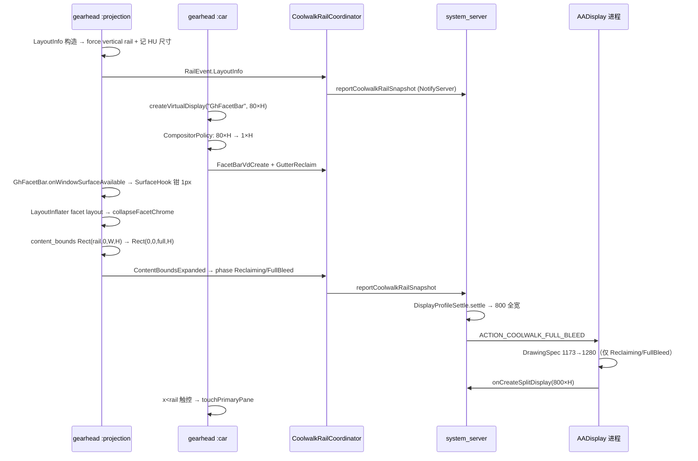

# COOLWALK_FACETBAR.md — FacetBar / 左轨回收与重连分辨率

Coolwalk 左侧 **FacetBar**（`GhFacetBar` VirtualDisplay + launcher/dashboard 图标列）与 **重连分辨率结算** 的架构说明与坑点备忘。  
运行时总链路见 [EXECUTION.md](EXECUTION.md)；仓库地图见 [AGENTS.md](../AGENTS.md)。

---

## 1. 问题背景

Android Auto Coolwalk 在 HU 左侧保留一条 **竖向导航轨**（FacetBar）：

| 层 | AA 原生表现 | AADisplay 目标 |
|----|-------------|----------------|
| **Compositor** | 具名 `GhFacetBar` VirtualDisplay，宽约 80–107px | **饿成 1×H**，合成器不再占槽 |
| **Layout** | `content_bounds` = `Rect(rail,0,HU−rail,H)` | 扩成 `Rect(0,0,fullHU,H)` |
| **View** | `gh_coolwalk_*facet*` 图标列 | GONE + 0 宽，兄弟内容 MATCH_PARENT |
| **Profile** | 分屏 VD 按 **720**（800−80）创建 | 回收后按 **800** 全宽 settle |
| **触控** | `x < rail` 命中 FacetBar VD | 偷到 PRIMARY 窗 / peel / AA UI |

四条链路不同步时会出现：**左侧黑条**、**右侧 gutter**、**触控落在死 VD**、**软重连 800/720 来回跳**。

---

## 2. 端到端链路概览

### 2.1 进程与职责

```
gearhead :projection                          gearhead :car
├─ CoolwalkFacetBarSurfaceHook  surface 宽钳制   ├─ AaCoolwalkLayoutHook       rail dimen → 0
├─ CoolwalkFacetChrome          视图折叠         ├─ AaCoolwalkCompositorHook   VD starve/expand
├─ AaCoolwalkLayoutHook         LayoutInfo       ├─ CoolwalkFacetChrome        视图折叠
├─ AaCoolwalkProjectionHook     content_bounds   ├─ AaCoolwalkHuTouchHook      HU 触控偷渡
├─ AaCoolwalkCompositorHook       VD policy        └─ AaCoolwalkProjectionHook   content_bounds 镜像
└─ CoolwalkRailCoordinator ◄── RailEvent ──► (IPC) system_server
                                              ├─ CoolwalkRailStore (Settings.Global 镜像)
                                              └─ DisplayProfileSettle → profile lock

io.github.nitsuya.aa.display (AADisplay 进程)
└─ AaDisplayProcessHook → CoolwalkDrawingSpecWiden  (DrawingSpec / presentation 加宽)
```

### 2.2 典型冷连时序



### 2.3 软重连补充

gearhead 进程常存活，AA 断连再连时：

1. `AaCoolwalkProjectionHook` 检测 projection config  republication → `onProjectionConfigSignal`。
2. 若距上次 config > 8s 或 phase 需重置 → `RailEvent.ReconnectStarted`（清空上一车 HU 真值）。
3. 无论是否 reset，**reclaim 仍要跑**：`reclaimAllWindowGutters` + `scheduleEnsureFacetBar` + `starveSurvivingFacetBarVds`（250ms / 1s 重试）。
4. `CoolwalkRailStore.markReconnectEpoch` + `SETTINGS_RECONNECT_UPTIME_MS` 供各进程识别近期重连，避免 content_bounds 幂等跳过。

---

## 3. Hook 入口（`AaUiHook`）

**注册：** `AndroidAutoHook` → `AaUiHook`（`:projection` + `:car`）。  
**DexKit 解析：** `content_bounds` 方法、`onWindowSurfaceAvailable`（facet surface）、HU touch dispatch、`LayoutInfo` 类（仅 `:projection`）。

### 3.1 两进程安装清单

| 模块 | `:projection` | `:car` | 说明 |
|------|:-------------:|:------:|------|
| `CoolwalkDrawingSpecWiden.installGearhead` | ✓ | ✓ | gearhead 内 DrawingSpec 构造加宽 |
| `CoolwalkProjectionBoundsHook` | ✓ | ✓ | compositor `{blX}` 左轨 inset → 0 |
| `CoolwalkFacetBarSurfaceHook` | ✓ | ✓ | `GhFacetBar.onWindowSurfaceAvailable` 宽→1 |
| `AaCoolwalkProjectionHook` | ✓ | ✓ | `content_bounds` / `pillar_width` / `content_insets` |
| `AaCoolwalkLayoutHook`（LayoutInfo） | ✓ | — | 强制 vertical rail、canvas 加宽 |
| `AaCoolwalkLayoutHook`（rail dimen） | — | ✓ | `Resources.getDimension*` → 0 |
| `AaCoolwalkCompositorHook` | ✓ | ✓ | VD create/resize 改写 |
| `CoolwalkFacetChrome` | ✓* | ✓* | 视图折叠；*需 `canHookFacetBar` |
| `AaCoolwalkHuTouchHook` | — | ✓ | HU 触控偷渡 |
| `AaCoolwalkAutoOpenHook` | ✓ | — | facet/content_bounds 后自动开 AADisplay |

**AADisplay 进程（非 gearhead）：** `AaDisplayProcessHook` → `AaDisplayPresentationResize.hookDisplayManager()` → `CoolwalkDrawingSpecWiden.installAaDisplayLazy()`。  
**禁止**在 gearhead 侧 resize `AaDisplayActivity` presentation VD（会黑屏）；presentation 缓冲只在 AADisplay 进程 create 时加宽。

### 3.2 `canHookFacetBar` 前置条件

`CoolwalkHookEnv.loadProjectionResources()` 解析 gearhead 资源 id：

- facet layout：`gh_coolwalk_vertical_facet_bar`、`gh_coolwalk_facet_bar`（及 `_rhd` 变体）
- 内容特征 id：`status_bar`、`launcher_and_dashboard_icon_container`、`launcher_and_dashboard_icon`
- canonical rail host：`sys_ui_layout_canonical_vertical_rail_lhd` / `_rhd`

任一缺失则跳过 `CoolwalkFacetChrome`（VD / content_bounds 路径仍生效）。

---

## 4. 模块地图

| 类 | 路径 | 职责 |
|----|------|------|
| `CoolwalkRailCoordinator` | `xposed/hook/aa/coolwalk/` | gearhead 内 **单一状态机**；`onEvent` → `RailSnapshot` + `RailAction` |
| `CoolwalkRailTypes` | 同上 | `RailPhase`、`RailSnapshot`、`RailEvent`、`RailAction` |
| `CoolwalkRailMath` | 同上 | 纯几何（轨宽区间、content_bounds 展开、HU 宽度合并）— **可 JVM 单测** |
| `CoolwalkCompositorPolicy` | 同上 | VD create/resize 改写：FacetBar→1×H、内容 VD 扩满、Dashboard→1×1 |
| `AaCoolwalkCompositorHook` | 同上 | hook `DisplayManager.createVirtualDisplay` / `VirtualDisplay.resize` |
| `CoolwalkFacetBarSurfaceHook` | 同上 | `:projection` 侧 **早于** VD starve 的 surface 宽钳制 |
| `CoolwalkProjectionBoundsHook` | 同上 | compositor `{blX=…}` 窗几何：单轨 inset → `blX=0` |
| `CoolwalkFacetChrome` | 同上 | inflate / windowAttach / ensure poll：折叠 facet 列、回收 gutter |
| `AaCoolwalkProjectionHook` | 同上 | 改写 projection `content_bounds` 等；软重连 reclaim 编排 |
| `AaCoolwalkLayoutHook` | 同上 | LayoutInfo 强制 vertical rail；`:car` rail dimen 归零 |
| `AaCoolwalkHuTouchHook` | 同上 | `:car` HU touch steal → `ICoreManager.touch*` |
| `CoolwalkDrawingSpecWiden` | 同上 | `DrawingSpec` 从 content slot 加宽到 full HU |
| `CoolwalkHookEnv` | 同上 | 共享可变状态、资源 id、ensure 定时器 |
| `CoolwalkRailStore` | `util/` | `Settings.Global` + `serverSnapshot`（跨进程真值镜像） |
| `DisplayProfileSettle` | `util/` | system_server：**单一 settle 规则** |
| `CoreManagerService` | `xposed/` | `resolveDisplayProfile`、`reportCoolwalkRailSnapshot`、450ms rail-settle 重试 |

---

## 5. 五条回收路径（必须都打通）

### 5.1 View — `CoolwalkFacetChrome`

历史命名 **inject** 实际行为是 **collapse**（折叠 facet 列，不是注入 AADisplay 按钮）。

1. **`LayoutInflater.inflate`**  
   - 命中 facet layout id，或 **status_bar + launcher 图标** 内容特征 → `collapseFacetChromeInPlace`（GONE、width=0、展开兄弟 MATCH_PARENT）。  
   - 命中 canonical rail host → `tryInjectIntoFacetColumn` 或 `scheduleEnsureFacetBar`。

2. **`WindowManagerGlobal.addView`**  
   - **Before：** 具名 FacetBar 窗口 `attrs.width` 钳为 1。  
   - **After：** `suppressFacetBarPresentationRoot`（Presentation 根隐藏）、`reclaimLeftGutter`、晚到 chrome 再 ensure。

3. **ensure 窗口**  
   - `FACET_ENSURE_WINDOW_MS = 2000`，`FACET_ENSURE_POLL_MS = 250`。  
   - inject 成功即停 poll；不再把 deadline 续满（避免占 ~107px 的 GhostActivity 宿主永远扫不到）。  
   - `reclaimAllWindowGutters`：starve/collapse/reconnect 时扫 **进程内全部窗口根**。

4. **触发 ensure 的入口**  
   - `AaCoolwalkLayoutHook`（LayoutInfo 后）  
   - `AaCoolwalkProjectionHook`（软重连 reclaim）  
   - `windowAttach`、rail host inflate

### 5.2 Compositor — `AaCoolwalkCompositorHook` + `CoolwalkCompositorPolicy`

- 具名 FacetBar / GhFacet / VerticalRail / EdgeColumn：**create 时 `W×H → 1×H`**，并发 `FacetBarVdCreate` 记 `touchRailWidthPx`（**仅触控**，不给 profile）。
- 无名瘦长 VD（≤120px 且高≥3W）：同样饿成 1×H。
- 内容 VD 宽度 < layout 全宽且缺口像 **单条轨**：扩到 `fullHuWidthPx`。
- `Dashboard` VD：**1×1**（空媒体卡）。
- **禁止**改写名为 `AaDisplayActivity` 的 presentation VD。
- **软重连：** `starveSurvivingFacetBarVds` 对仍存活且宽>1 的 FacetBar VD 调 `VirtualDisplay.resize(1,H)`。

### 5.3 Surface（:projection 抢先）— `CoolwalkFacetBarSurfaceHook`

`:projection` 里 `GhFacetBar.onWindowSurfaceAvailable` 可能在 `:car` starve VD **之前**执行，合成器仍会按 ~80–107px 记槽。

- DexKit 命中 `onWindowSurfaceAvailable width:` / `dimensions:` 方法。  
- `clampSurfaceArgs`：具名或瘦长几何的宽参数 → 1，并 post `GutterReclaim` + `reclaimAllWindowGutters`。

### 5.4 Projection 配置 — `AaCoolwalkProjectionHook`

- Hook `content_bounds` / `content_insets` / `pillar_width` → 0（多路径：DexKit 方法、Bundle/ArrayMap/Intent、Rect 构造/set 备份）。
- `computeExpandedContentBounds` 三种形态：
  - **Form A:** `Rect(rail,0,fullW,H)`
  - **Form B:** `Rect(rail,0,contentRight,H)` 且 `contentRight+rail` = 真全宽
  - **Form C:** `Rect(0,0,contentW,H)` 且已知 `fullHu` − `contentW` 为单轨缺口
- 扩满后 `RailEvent.ContentBoundsExpanded`；连续稳定 `FULL_BLEED_STABLE_THRESHOLD=3` 次 → `RailPhase.FullBleed`。
- 广播 `ACTION_COOLWALK_FULL_BLEED` → `AaMainFragment.requestDisplay`（或 system_server `notifyCoolwalkFullBleed`）。

### 5.5 Compositor 几何 blX — `CoolwalkProjectionBoundsHook`

Content Surface 常按 `{blX, trX}` 的 `trX − blX` 分配。FacetBar 饿死后 AA 仍可能 `blX=rail`（如 107→1280 ⇒ slot 1173）→ 左侧黑条。

- DexKit 命中 `{blX=` toString 的 bounds 类，hook 构造把疑似单轨 `blX → 0`。  
- **真重连**（`ReconnectSettling` 且 `fullHuWidthPx ≤ 0`）不扩，防串车。  
- 与 `content_bounds` / DrawingSpec 互补：扩 bounds 配置 + 扩 compositor 窗几何。

### 5.6 Layout / Dimen — `AaCoolwalkLayoutHook`

**:projection**

- `LayoutInfo` 构造：强制 `hasVerticalRail=true`、canonical vertical rail layout id。  
- `widenLayoutInfoToFullHu`：回收后把 canvas 从 content slot 扩到 full HU（`hasVerticalRail` 保持 true，避免掉回底栏）。  
- 构造后 `RailEvent.LayoutInfo` + `scheduleEnsureFacetBar`。

**:car**

- `Resources` / `ResourcesImpl` 的 `getDimension*`：rail width dimen id → 0。  
- 防止 `GhLifecycleService` 仍按 HU−rail 发 `content_bounds`。

### 5.7 Profile — `DisplayProfileSettle` + `CoreManagerService`

**单一规则**（`DisplayProfileSettle.settle`）：

```
live FacetBar VD 条带宽度 > 1  →  settle 到 fullHU − rail
条带 ≤ 1（已 starve）          →  若 reported 仍是 content slot 且 reclaim 未证明，暂保持 reported；
                                 否则 settle 到 fullHU
```

- **live rail** 来自 `DisplayManager` 扫具名 FacetBar VD 的 `physicalWidth`（system_server 可见私有 VD）。
- **不要用 `touchRailWidthPx` 做 profile**（那是 `:car` 触控 steal 带宽）。
- 软重连首次 create 后 **450ms `rail-settle` 重试**（`RAIL_SETTLE_RETRY_MS`）。
- `reportCoolwalkRailSnapshot` 在 full 变大或 `FullBleed` 时也会 `scheduleRailSettleRetry`。

### 5.8 Presentation 加宽 — `CoolwalkDrawingSpecWiden`

Car SDK 在 AADisplay 进程按 **content 槽**分配 encoder Surface。回收后需把 `DrawingSpec` 从 720/1173 扩到 800/1280：

- gearhead：构造 / `CREATOR.createFromParcel` hook。  
- AADisplay：`ClassLoader.loadClass(DrawingSpec)` 懒 hook。  
- `isContentSlotVsFull` 且已知 `fullHu` 时加宽：`Reclaiming` / `FullBleed`，以及 **`ReconnectSettling` 且 fullHu>0**（IPC 滞后或误降级残留）。  
- **真重连**清空 fullHu 后不加宽。starve + content_bounds 的 presentation relaunch 共用 `AaCoolwalkAutoOpenHook` **2s debounce**。

---

## 6. 状态机（RailPhase）

| Phase | 含义 |
|-------|------|
| `Bootstrapping` | 冷连，尚无 LayoutInfo |
| `RailPresent` | 观测到活轨宽（VD 或 dimen） |
| `Reclaiming` | 正在 collapse / starve / 扩 content_bounds |
| `FullBleed` | `content_bounds` 连续稳定全宽（阈值 3） |
| `ReconnectSettling` | 软重连后丢弃上一车的 HU 真值，等新 LayoutInfo |

**软重连：** `RailEvent.ReconnectStarted` 清空 `fullHuWidthPx` / layout，避免上一台车的 1280 污染本次 800。

**`RailWidthObserved` 不降级 FullBleed/Reclaiming：** 只更新 `touchRailWidthPx`（与 `FacetBarVdCreate` 一致）。瞬时瘦长 VD / starve 前观测不得清 `fullBleedStableCount`、不得打成 `ReconnectSettling`。真软重连只走 `ReconnectStarted` / projection session gap。

### 6.1 RailEvent 触发源对照

| RailEvent | 典型触发源 |
|-----------|------------|
| `LayoutInfo` | `AaCoolwalkLayoutHook` LayoutInfo 构造后 |
| `RailWidthObserved` | VD 观测、dimen 归零、瘦长 VD 发现（FullBleed/Reclaiming 下不改 phase） |
| `FullHuObserved` | `AaCoolwalkCompositorHook.rememberFullHuSize` |
| `FacetDisplayId` | FacetBar VD create / `:car` DisplayManager 扫描 |
| `ContentBoundsExpanded` | `AaCoolwalkProjectionHook.applyExpandedContentBounds` |
| `FacetBarVdCreate` | `CoolwalkCompositorPolicy` 具名 FacetBar create |
| `ReconnectStarted` | `onProjectionConfigSignal` / `maybeBeginReconnectIfNeeded` |
| `GutterReclaim` | collapse、starve、surface-clamp、windowAttach |

### 6.2 RailAction 副作用

| RailAction | 执行 |
|------------|------|
| `NotifyServer` | `CoreManager.tryReportCoolwalkRailSnapshot` → system_server |
| `ReclaimAllGutters` | `CoolwalkFacetChrome.reclaimAllWindowGutters` |

Left gutter reclaim runs directly in `CoolwalkFacetChrome.reclaimLeftGutter` / `scheduleReclaimLeftGutter` on window attach and rail layout inflate — not via `RailAction`.

---

## 7. 跨进程 IPC 与状态同步

### 7.1 IPC 契约（`ICoreManager`）

| 方法 | 方向 | 用途 |
|------|------|------|
| `reportCoolwalkRailSnapshot(phase, touchRail, fullHu, facetId)` | gearhead → system_server | 发布 rail 快照；写 `CoolwalkRailStore` + Settings.Global |
| `getCoolwalkRailSnapshot()` | 任意 → system_server | 返回 `int[4]` 同上字段 |
| `getCoolwalkReconnectEpochMs()` | 任意 → system_server | 软重连 epoch（uptime） |
| `notifyCoolwalkFullBleed()` | system_server → AADisplay | `ACTION_COOLWALK_FULL_BLEED` 广播 |

### 7.2 Settings.Global 键（勿改 key 名）

| Key | 含义 |
|-----|------|
| `aadisplay_cw_rail_phase` | `RailPhase.code` |
| `aadisplay_cw_rail_touch_w` | `touchRailWidthPx` |
| `aadisplay_cw_rail_full_w` | `fullHuWidthPx` |
| `aadisplay_cw_rail_facet_id` | FacetBar `displayId` |
| `aadisplay_cw_session_full_w` / `_touch_w` | 冷连 full-bleed 会话缓存（软重连不清） |
| `aadisplay_cw_reconnect_uptime_ms` | 软重连 epoch |

### 7.3 真值合并规则（`CoolwalkRailCoordinator.syncExternalTruth`）

1. 读 `CoolwalkRailStore.serverSnapshot`（跨 boot 消毒 `sanitizeCrossBoot`）。  
2. 读 Settings.Global（`CoolwalkRailStore.read`）。  
3. 读 `CoreManager.tryGetCoolwalkRailSnapshot()`；若对端 `ReconnectSettling` 则本地也 reset phase。  
4. `absorbExternalFullHu`：**不同 HU 几何不合并**，防止换车污染。  
5. `:car` 启动时 `AaCoolwalkHuTouchHook.syncServerRailSnapshot` 拉 server 快照。

---

## 8. 触控与轨宽分离

| 字段 | 用途 |
|------|------|
| `touchRailWidthPx` | `:car` HU touch steal 的 x 带宽度（`railHitWidthPx`） |
| FacetBar VD `physicalWidth` | profile settle 的 **compositor 条带** |
| `effectiveRailWidthPx` | 设计上恒 0（内容/profile 目标无轨） |

`:car` `AaCoolwalkHuTouchHook` 在 `CarActivityManagerService` HU touch dispatch 处偷 `x < railHitWidth` 的触控：

| 条件 | IPC 落点 |
|------|----------|
| 应用选择器（`ACTION_AA_UI_RAIL_CONSUME`） | `touchAaDisplay` |
| 全屏 + peel 命中带 | `touchAaDisplay` |
| 其余左侧 rail 带 | `touchPrimaryPane` |

时间戳必须用 **uptime**（`rewriteMotionEvent`）。MOVE 走 Choreographer 帧合并，避免 Binder 风暴。

**轨宽发现：** 优先具名 FacetBar VD；否则绝对窄条 ≤120px；**禁止** `DEFAULT_DISPLAY`；`CarDisplayId` 白名单 accessor。

---

## 9. 关键坑点（改代码前必读）

### 9.1 打 tag 就停 poll → 左侧黑条复发

早期实现：facet 宿主一 `tag = injected` 就停止 ensure / 全窗 reclaim。  
真正占 107px 的 **GhostActivity 窗口** 可能从未 inflate facet layout，只有瘦长宿主。  
**现规则：** ensure / attach / collapse / starve 都扫全部 `WindowManagerGlobal` 根；inject 成功停 poll；晚到 chrome 靠 LayoutInfo / `windowAttach` 再武装。

### 9.2 在 gearhead resize CarActivity presentation → 黑屏

Car SDK 在 **AADisplay 进程** 按 content 槽分配 encoder Surface。  
在 gearhead 把同名 VD 改成 full HU 但 Surface 仍是 720 宽 → HU 全黑。  
**对策：** `CoolwalkCompositorPolicy` 对 `AaDisplayActivity` VD **不改写**；  
`CoolwalkDrawingSpecWiden` 仅在 AADisplay / gearhead DrawingSpec 构造加宽。

### 9.3 FacetBar 已 1px 但 `content_bounds` 仍 HU−rail

`:car` 若未 zero rail dimen，`GhLifecycleService` 仍发 `Rect(0,0,HU−rail)`，合成器留空槽。  
**对策：** `:car` 同样 zero dimens + VD starve；`:projection` 扩 `content_bounds`。

### 9.4 `touchRailWidthPx` 误用于 profile

会把 profile 锁在 720 即使 compositor 条带已消失 → 右侧 gutter。  
**对策：** `resolveRailWidthPx()` 只看 live VD；`FullBleed` phase 直接 0。

### 9.5 reported 已是 content slot 时盲目扩到 full HU

FacetBar 已 starve，但 CarActivity presentation 可能仍是 HU−rail。  
此时把 **分屏 VD** settle 到 full HU → 内容 letterbox 在较小 presentation 里，或 resize 该 VD 黑屏。  
**对策：** `DisplayProfileSettle.isContentSlotVsFull` + `coolwalkReclaimProven` — gap 在轨宽区间内则 **保持 reported**，直到 server 证明 full-bleed。

### 9.6 跨车 HU 真值污染

上一连接 1280×720 写入 Settings / IPC，换 800×480 车机后仍用 1280 扩 VD。  
**对策：** `ReconnectStarted` 清空；`pickConnectionFullHuWidth` / `isSameHuGeometry` 拒绝不同几何；`absorbExternalFullHu` 不同 HU 不合并。

### 9.7 双轨缺口误当 full HU（720+80+80）

双轨缺口（如 720→880）不是真 HU 变宽。  
**对策：** `isPlausibleRailGap` 限制单轨；`pickConnectionFullHuWidth` / `isSameHuGeometry` 在 `extra ≤ 3×rail` 时拒绝 +rail 膨胀。

### 9.8 瘦长主屏误当 FacetBar（r6 回归类）

竖屏手机 1080×2340 被当 rail VD，`CarDisplayId` 反射扫到 `describeContents()==0` → 整屏触控被 steal。  
**对策：** 禁止 `DEFAULT_DISPLAY`；优先具名 FacetBar；无 LayoutInfo 时仅绝对窄条 ≤120px；`CarDisplayId` 白名单 accessor。

### 9.9 ensure 窗口过长 → 性能 / 逻辑干扰

8s poll 且每次 collapse 续 deadline 会长时间扫窗。  
**现参：** `FACET_ENSURE_WINDOW_MS = 2000`，`FACET_ENSURE_POLL_MS = 250`。

### 9.10 DexKit `content_bounds` / LayoutInfo 未命中

AA 17.x 布局 id 变化 → facet 按钮消失、回收不触发。  
**对策：** 多 layout id + 内容特征检测；DexKit 缓存 key 见 `AaUiHook`；失败看 `AAD_*` 日志。

### 9.11 `:projection` surface 与 `:car` VD 竞态

FacetBar surface 可能在 VD starve 前登记 ~107px 槽。  
**对策：** `CoolwalkFacetBarSurfaceHook` 与 compositor starve **双保险**。

### 9.12 `RailWidthObserved` 误降级 FullBleed → DrawingSpec hold

早期实现：FullBleed 后再观测到轨宽（>1）会打成 `ReconnectSettling` 并清 `fullBleedStableCount`，而 `fullHu` 仍保留 → DrawingSpec / LayoutInfo 门闩 hold content slot，blX 却可能已扩 → 合成器全宽、编码仍窄。  
**对策：** `FullBleed` / `Reclaiming` 下 `RailWidthObserved` 只更新 `touchRail`；真重连只走 `ReconnectStarted`。DrawingSpec / canvas 在 settling 且 **已知 fullHu** 时仍可加宽 content slot。

---

## 10. 日志与验证

| 日志标签 | 看什么 |
|----------|--------|
| `AAD_CoolwalkRail` | `phase=`、`full=`、`touchRail=`、`event=` |
| `AADisplay_CoreManagerService` | `displayProfile locked/relocked(settle|rail-settle)`、`CoolwalkRail snapshot` |
| `AADisplay_AaUiHook` | `starve FacetBar`、`content_bounds expanded`、`collapse facet rail` |
| `AAD_AaDisplayVD` | `DrawingSpec widen` / `presentation VD create`（AADisplay 进程） |

**软重连回归：**

1. `GhFacetBar` 饿死后 profile 稳定全宽；无右侧 gutter / 左侧黑条。
2. 左轨触控仍可注入（starve 后 hit 宽用观测轨宽，非 1px）。
3. 换分辨率车机（如 800 vs 1280）冷连各 settle 一次，不串车。

---

## 11. 改动约束

- **勿改** `CoolwalkRailStore` Settings key、`ICoreManager.reportCoolwalkRailSnapshot` 签名。
- **勿在 gearhead** resize `AaDisplayActivity` presentation VD。
- profile 逻辑集中在 `DisplayProfileSettle` + `CoreManagerService.resolveDisplayProfile`；不要在客户端再叠 grow/shrink 梯。
- 新轨宽启发式优先放进 `CoolwalkRailMath` 并补单测。
- FacetBar 相关新钩子放 `xposed/hook/aa/coolwalk/`，经 `CoolwalkRailCoordinator.onEvent` 上报，不要各模块私藏 HU 宽度。
