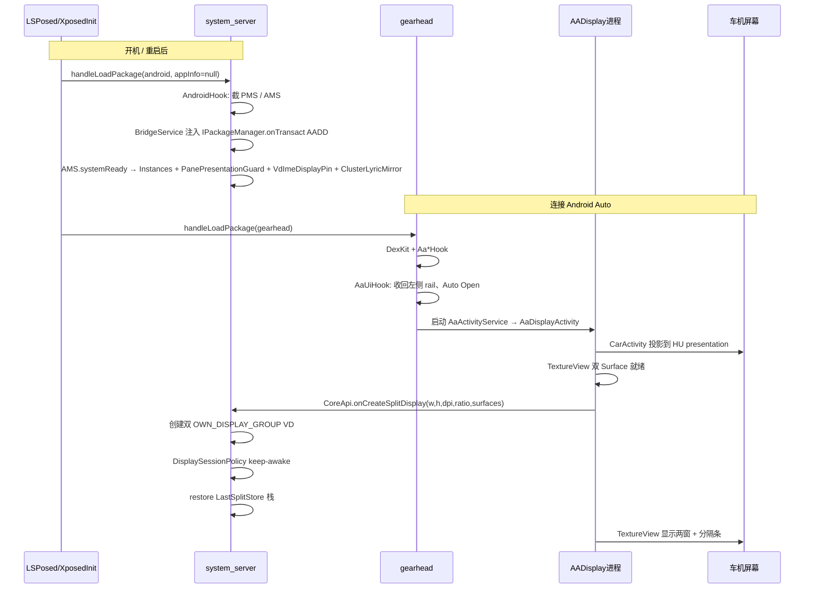
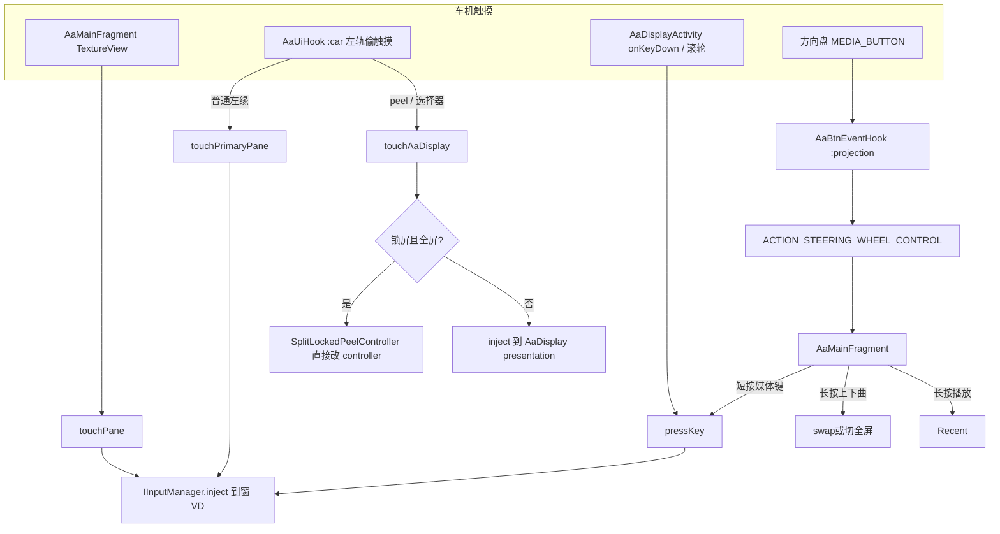

# EXECUTION.md — AADisplay 运行时逻辑链路

给后续 AI / 开发者用的**执行顺序文档**。仓库地图、改动硬规则、LSPosed scope 见根目录 [AGENTS.md](../AGENTS.md)。  
**改显示、IPC、钩子、触控、会话生命周期前先读本文**，再动代码。

路径均相对仓库根。Kotlin 源码默认在 `aa-display/src/main/java/io/github/nitsuya/aa/display/`。

---

## 0. 先建立的心智模型

本模块不是普通 App：它是 **LSPosed 模块**。真正干活的代码跑在 **system_server**；车机画面跑在 **AADisplay 进程的 CarActivity**；Android Auto（gearhead）只负责 HU 壳、把触控/按键偷过来、以及把本模块当成投影 App 拉起。

```
手机 HU 画面 = AaDisplayActivity 里两块 TextureView 合成
应用真实窗口 = system_server 里两块独立 VirtualDisplay（PRIMARY / SECONDARY）
跨进程能力   = 只能走 CoreApi → ICoreManager（禁止在 AA / App 进程直接 createVirtualDisplay）
```

三进程（再加被投应用自己的进程）：

| 进程 | 谁注入 | 常驻对象 | 禁止做的事 |
|------|--------|----------|------------|
| `system_server` | `AndroidHook` | `CoreManagerService`、`SplitDisplayController`、`DisplaySessionPolicy`、`ClusterLyricMirror` | 不要从这里 inflate 车机 UI |
| `io.github.nitsuya.aa.display` | 无 Xposed 钩子 | `AaDisplayActivity` / `AaMainFragment` | 不要直接操作 VD / ATMS |
| `gearhead`（`:projection` / `:car`） | `AndroidAutoHook` → `Aa*Hook` | Coolwalk 壳、HU 触控、Auto Open、仪表 Title 改写 | 不要在这里创建分屏 VD |
| 被投 App | 无（仅 DPI pin 等 system 侧） | 任务窗口画在 VD 上 | — |

`CoreApi` 选路（`CoreApi.kt`）：**只有真正的 system_server**（`AndroidHook.isReadyForSystemHooks()`）才用 `CoreManagerService.instance`；其余一律 `CoreManager` 经 PMS 桥拿 Binder。不要用 `uid == 1000` 判断——三星等 OEM 系统应用也是 1000。

---

## 1. 总链路（从开机到车机有画面）



---

## 2. 模块加载（Xposed 入口）

入口文件：`aa-display/src/main/assets/xposed_init`  
类：`xposed/XposedInit.kt`

1. `initZygote` → EzXHelper。
2. `handleLoadPackage` **只认两路**，其余包不注入：

| 条件 | 对象 | 进程确认 |
|------|------|----------|
| `packageName == "android"` **且** `lpparam.appInfo == null` | `AndroidHook` | 再用 `/proc/self/cmdline == system_server`（`AndroidHook.isReadyForSystemHooks()`） |
| `packageName == com.google.android.projection.gearhead` | `AndroidAutoHook` | 再按 `processName` 过滤各 `AaHook` |

LSPosed scope（`res/values/arrays.xml`）：`android` + gearhead。少勾一项则对应半边整条链路断。

---

## 3. system_server 起桥（没有这一步，车机 UI 全是空转）

文件：`xposed/hook/AndroidHook.kt`、`xposed/BridgeService.kt`

```
ServiceManager.addService("package")
  → 拿到 IPackageManager
  → BridgeService.register(pms)
  → hook IPackageManager.onTransact
  → code == 'AADD' 且 uid ∈ {本模块, gearhead}
  → reply.writeStrongBinder(CoreManagerService.instance)

AMS 构造 → 捕获 system UI Context → CoreManagerService.systemContext
AMS.systemReady → Instances.init + PanePresentationGuard + VdImeDisplayPin + VdOrientationFill + ClusterLyricMirror
```

客户端拿 Binder：`xposed/CoreManager.kt` `getService()`  
`ServiceManager.getService("package")` → transact `TRANSACTION=AADD` + `ACTION_GET_BINDER=1`。

硬约束：

- magic **`AADD`**、descriptor `android.content.pm.IPackageManager` 禁止改名。
- 只放行 **本模块 uid** 和 **gearhead uid**（`:car` 轨触控也要过桥）。
- AIDL **只能在接口末尾追加** 方法，否则旧 system_server Stub 序数错位（需重装模块并重启）。

---

## 4. Android Auto 侧钩子（gearhead 进程）

总控：`xposed/hook/AndroidAutoHook.kt`

`Instrumentation.callApplicationOnCreate` 里：先读 `DexKitMethodCache`（gearhead `cache/aadisplay_dexkit_{car|projection}.properties`）；全命中则跳过扫包，否则 `System.loadLibrary("dexkit")` → 未命中 hook 的 `loadDexClass` → `saveCache` → `hook()`。
每个 hook 的 `loadDexClass` / `hook` **单独** `runCatching`：某一个失败只跳过该 hook，其余仍会装上（日志 `AAD_AndroidAutoHook` / `AAD_*` / `AAD_DexKitCache`）。
DexKit 查询 **不要** 写 `searchPackages = listOf("")`（2.0.7 会只搜无名包，`AaSignatureHook` / LayoutInfo 等命中 0）。

进程常量（`AaHook`）：

- `:projection` = `com.google.android.projection.gearhead:projection`
- `:car` = `com.google.android.projection.gearhead:car`

| Hook | 进程 | 做什么 |
|------|------|--------|
| `AaSignatureHook` | `:car` | 本模块包名签名校验返回 true，AA 才肯跑 CarActivity |
| `AaFrxRequiredAppsHook` | 两者 | Google App / Maps / TTS 的 FRX 状态强制 READY |
| `AaNavFallbackHook` | 两者 | 禁用 `NavigationFallbackCarActivityService`（缺 Maps 否则占位页崩 `:car`） |
| `AaMediaPlaceholderHook` | 两者 | **保持** `MediaCarAppService` 启用（元数据出站）；隐藏残留 Dashboard Presentation；吞 Dashboard cover 断言 |
| `AaClusterLyricEgressHook` | 两者 | 读 `MediaMetadata` Title/Subtitle 时注入 `ClusterLyricStore` 仪表横条文案 |
| `AaBtnEventHook` | `:projection` | 偷 MEDIA_BUTTON / projected.KEY_EVENT → 广播给车机 UI |
| `AaUiHook` | 两者（职责不同） | 见下节 |

### 4.1 AaUiHook 内部分工

文件：`xposed/hook/aa/AaUiHook.kt`（DexKit + 资源 id，易碎）

**`:projection`（AA 壳 / Facet / VD 尺寸）**

1. 把 Coolwalk 左侧 rail 相关 dimen **置 0**，让内容区拿满 HU 宽。
2. `LayoutInfo` 强制 `hasVerticalRail=true`，避免 800×480 掉回底栏。
3. 改 FacetBar：藏 launcher/dashboard 图标，把内容区让给 `AaDisplayActivity`。
4. `rewriteVirtualDisplayArgs`：名为 `Dashboard` 的 VD **饿成 1×1**（空媒体卡）。
5. Auto Open：多次延迟调用 `CarSystemUiControllerService` 静态 `start(Intent)`，组件是本模块 `AaActivityService`。收到 `ACTION_AA_DISPLAY_SHOWN` 才停重点。

**`:car`（HU 输入 / content_bounds）**

1. 改写 projection `content_bounds`，不要再给左侧留 rail 矩形。
2. Hook HU touch dispatch：落在原 rail 带的触摸 **偷走**，经 `CoreManager` 注入。
3. 路由（DOWN/MOVE 都不得 Binder 查全屏；只信 `ACTION_SPLIT_STATE_CHANGED`，注册后一次异步预热）：

| 条件 | IPC | 落点 |
|------|-----|------|
| 应用选择器打开（`ACTION_AA_UI_RAIL_CONSUME`） | `touchAaDisplay` | CarActivity presentation |
| 全屏 + 点在 peel 命中带（`SplitPane.peelHitContains`） | `touchAaDisplay` | 分隔条 / peel |
| 其余左侧 rail 带 | `touchPrimaryPane` | PRIMARY 窗 VD |

触控解码必须用 **uptime** 作为 `downTime/eventTime`。Coolwalk 自带时间戳进 InputDispatcher 会被丢。

---

## 5. 车机 UI 进程：从 CarActivity 到双 Surface

### 5.1 拉起

```
Android Auto 绑定 AADisplay 的投影 Service
  AndroidManifest: AaActivityService
    CATEGORY_PROJECTION / NAVIGATION / OEM
  AaActivityService.getCarActivity() → AaDisplayActivity
  AaDisplayActivity.onCreate → AaDisplayActivityKt.showMain → AaMainFragment
  onResume → 广播 ACTION_AA_DISPLAY_SHOWN（取消 Auto Open 重试）
```

- 手机状态页：`ui/main/MainActivity.kt`（`MAIN` + `CATEGORY_INFO`，无桌面图标）。用 `CoreApi.buildTime` 对比 `BuildConfig.BUILD_TIME`：0 未激活 / 相等已激活 / 不等需重启。
- 车机 UI **没有** LAUNCHER Activity；只走 Car SDK。

### 5.2 创建分屏显示（软/硬连接共用一个入口）

`ui/aa/fragment/AaMainFragment.kt`：

1. `initViews`：读 `LastSplitStore` 做乐观比例/全屏；绑两个 `TextureView`；分隔条手势。
2. 两块 Surface 都 `available` 且 `splitContainer` 有宽高 → `requestDisplay`。
3. DPI 取 **HU presentation** 的 density，不要写死、不要用手机默认 Display。
4. `CoreApi.onCreateSplitDisplay(w, h, dpi, ratio, primarySurface, secondarySurface, listener)`。
5. `onAvailableDisplay`：再 `setPaneSurface`、注册控制广播、settle 占用/比例。
6. 多次 `reportAaUiDisplayId`（layout / resume / surface / created）：presentation 是 `FLAG_PRIVATE`，system_server 枚举不到，peel 注入靠这个 id。

`requestDisplay` 跳过条件：宽高未就绪、缺 Surface、创建已在途、**profile 未变**（避免 TextureView 改 weight 反馈打 VD）。  
`onSurfaceTextureSizeChanged` **禁止**再 `requestDisplay`。

### 5.3 system_server 创建 / 重连

`xposed/CoreManagerService.kt` `onCreateSplitDisplay`（切 Main）：

```
已有 SplitDisplayController？
  是 → 软重连：
      DisplaySessionPolicy.onResume()  （取消 180s Delay Destroy）
      重新绑 Surface
      onReconnected(locked profile)
      keepVirtualDisplayAwake("soft-reconnect", forceWake)
      比例仅在与当前差 ≥ 0.01 时才 setSplitRatio（AA echo 不要打回去）
  否 → 硬创建：
      resolveDisplayProfile（见不变式）
      new SplitDisplayController { onConnected(...) }
      首帧回调后再 new DisplaySessionPolicy
```

`ui/aa/split/SplitDisplayController.onConnected`：

1. `DisplayManager.createVirtualDisplay` × 2（名字 `AADisplay-P/S-*`）。
2. 先 `onCreated(primaryDisplayId)` 让 TextureView 出画，再 post 应用 IME/旋转策略（三星 `freezeDisplayRotation` 很贵）。
3. 有合法快照则 `SplitLaunchRestore.scheduleRestoreLastSplit()`，并 `mSuppressReclaimUntil += 8s`。

VD flags（`SplitVdLifecycle.vdFlags`）——**不要加 `VIRTUAL_DISPLAY_FLAG_PRESENTATION`**（抖音 LivePlay 会把 Presentation 贴到另一窗，盖住导航并抢走焦点）：

`PUBLIC | SECURE | OWN_CONTENT_ONLY | TRUSTED | OWN_DISPLAY_GROUP | ALWAYS_UNLOCKED | TOUCH_FEEDBACK_DISABLED`

分屏时 **VD 缓冲 = 窗格 TextureView 尺寸**（HU × ratio − 分隔条）。全屏时两 VD 都是满 HU 缓冲，AA UI 只显示一块、底下那块继续渲染。  
不要改回「两窗都满幅再 crop」——半窗会变成全屏布局的中心切片 + 黑边。

### 5.4 Display profile lock

`CoreManagerService.resolveDisplayProfile`：

- 新会话：锁定本次 `w×h,dpi`。
- 软重连：同方向下 **允许只增不减**（收回 rail 后变大）；缩小/抖动保持旧锁，避免闪烁。
- 方向变了才 relock。
- 真正 `onDestroyDisplay` 走完才 `clearDisplayProfileLock`。

---

## 6. 会话生命周期（断线 ≠ 立刻拆 VD）

`ui/window/DisplaySessionPolicy.kt`（无手机悬浮窗）

| 事件 | 行为 |
|------|------|
| 首创成功 | Monitor wake lock（每块 VD 一把自己的 display-scoped `SCREEN_BRIGHT`）+ heartbeat |
| AA `onDestroy` / Fragment `onDestroy` | `CoreApi.onDestroyDisplay` → `policy.onDestroy` → **延迟 180s** 再 `controller.onDestroy()` |
| 180s 内重连 | `onResume`：`cancelAndJoin` 销毁任务，VD 复用 |
| 180s 到 | 释放 lock、拆 VD、清 profile lock、forceStop 窗内应用 |
| 手机 SCREEN_OFF | 立刻 keep-awake + 约 4s burst；heartbeat 改为 3s |
| 触控/按键 | `onVirtualDisplayUserInteraction`（1s 节流） |

Keep-awake 硬规则：

- AA 窗 **不许停在 ColorFade/OFF**（三星 `OWN_DISPLAY_GROUP` 会跟手机一起 doze）。
- `IPowerManager.userActivity` **只走带 displayId 的四参重载**；禁止全局 overload（会亮手机主屏）。
- `ACQUIRE_CAUSES_WAKEUP` 只做短 pulse，不要长持。

`SplitDisplayController.onDestroy`：先 persist 快照 → 卸 TaskStackListener → `removeTask` 窗内任务 → `forceStopPackageAsUser` → `VirtualDisplay.release`。

---

## 7. IPC 地图

契约：`aa-display/src/main/aidl/.../ICoreManager.aidl`  
实现：`CoreManagerService`（system_server）+ `CoreManager`（客户端代理）

| 方法 | 调用方典型场景 | 落到 |
|------|----------------|------|
| `onCreateSplitDisplay` | `AaMainFragment.requestDisplay` | 创建或软重连 |
| `setPaneSurface` | TextureView available/destroyed | `VirtualDisplay.surface =` |
| `setSplitRatio` / `getSplitRatio` | 分隔条松手 | resize VD；全屏中只改 `mRatioBeforeFullscreen` |
| `setSplitFullscreen` / `getSplitFullscreenPane` | 拖过边缘 / peel | 两 VD 满幅或按比例 |
| `getPanePackage` / `setFocusedPane` / `getFocusedPane` | 空窗遮罩 / Recent 焦点 | 栈顶包名；焦点窗记录 |
| `swapSplitPanes` | 点分隔条 / 方控长按上下曲 | 整栈 `moveRootTask` 对调，**VD 身份不变** |
| `startActivity` / `startActivityOnPane` | 选择器 / Recent 点选 | `PaneAppStack.pushToTop` + 启动或置顶 |
| `moveTaskId` / `moveTaskIdToPane` / `moveTaskToFront` | Recent 拖拽 | 跨 display 搬任务 |
| `moveSecondTaskToFront` | 方控长按快进键 | 当前焦点窗栈内第二任务置顶 |
| `removeTask` | Recent Close | 关任务；栈顶空则下一档 |
| `pressKey` | 方控短按 / Activity 方向键 | 注入到焦点窗 |
| `hideIme` **oneway** | 壳层「收起键盘」 | WMS/IMM hide；失败才对该 display 打 BACK（不 bringTaskToFront） |
| `getImePane` | 壳层芯片初次同步 | -1 隐藏；0/1 为正在显示 IME 的窗 |
| `touchPane` **oneway** | TextureView | 注入对应 VD |
| `touchPrimaryPane` **oneway** | Coolwalk 左轨 | PRIMARY VD |
| `touchAaDisplay` **oneway** | peel / 选择器 | presentation；锁屏全屏走 `SplitLockedPeelController` |
| `reportAaUiDisplayId` **oneway** | UI 多次上报 | `mAaUiDisplayId`；失败会广播让 UI 再报 |
| `getRecentTask` | `AaRecentTaskFragment` | 左=PRIMARY 栈，中=SECONDARY，右=手机 |

`touch*` 是 oneway：返回只表示 parcel 已入队，不表示 InputManager 已注入。`CoreManager.tryTouch*` 失败时 **不要吞掉 HU 事件**（调用方要放行给 AA）。

---

## 8. 分屏控制器内部（system_server 真源）

`ui/aa/split/SplitDisplayController.kt` 是门面，状态机拆到同目录协作类：

| 类 | 职责 |
|----|------|
| `SplitVdLifecycle` | flags、按比例算尺寸、resize、IME/旋转、keep-awake overlay |
| `SplitLaunchRestore` | restore / persist / ensure 空窗 / 校验 |
| `SplitOwnership` | ATMS 任务搬家、reclaim、bringToFront、1px nudge 铺满 |
| `SplitInputRecents` | `IInputManager.injectInputEvent`、Recent 列表 |
| `SplitImeController` | 轮询窗 VD 上 IME 可见性，广播给 AA 壳；`hideIme` 不抢任务焦点 |
| `PaneAppStack` | 每窗最多 3 个，底→顶，栈顶=画面 |
| `SplitTaskStackListener` | 栈变 → debounce reclaim + persist + 驱逐外窗 Presentation |
| `SplitLockedPeelController` | 手机锁屏时 presentation 被 Keyguard 挡住，全屏 peel 在 system_server 直接解析 |
| `SplitPresentationGuard` | 外包 `TYPE_PRESENTATION` 贴到本窗 VD → 拦 `addWindow` / `attachWindowContextToDisplayArea` |
| `SplitChromePackages` | 不参与 bounce/reclaim 的壳包名 |

主线程：`mHandler`（Main）。Binder 进来的 `swap` / `startActivity` / `moveTask*` 先 `runIO` 再 `runOnHandlerBlocking`，避免和 reclaim 抢。

### 8.1 多应用栈

`PaneAppStack`：

- 顺序 **底 → 顶**；`last()` = 正在显示 = `mPanePackages[pane]`。
- 同包不能同时在左右两栈。
- 满 3 再 push → 挤掉栈底并关掉对应任务。
- Launch / Recent 点选 = **压栈或置顶**，不是杀旧再开。
- 同步 ATMS 时必须先 `SplitOwnership.normalizeRootTasksBottomToTop`。三星 `getAllRootTaskInfosOnDisplay` 经常是 **顶→底**，且要用 `RootTaskInfo.visible`，不能假设 `lastOrNull` 就是前台。

高德：LAUNCHER 常是 `UsbFillActivity`，VD 上实际是 `MainMapActivity`。`bringTaskToFront` 必须按 **现有 task 的 topActivity** 重排并校验真成顶，失败就清僵尸再冷启，禁止把失败切换写成栈顶。

### 8.2 restore

`SplitLaunchRestore.restoreLastSplitNow`：

1. 读 `LastSplitStore`（Settings.Global 优先，失败再 `/data/system/aadisplay_last_split.properties`）。
2. 按快照比例 resize（先不要全屏）。
3. 每窗按 **底→顶** `startActivityOnPane`，再 `setStackBottomToTop`，再把快照 front `bringTaskToFront`。
4. 最后才 `setSplitFullscreen`。
5. 2s / 再 2s 校验 front 是否真在对应 display 上，最多 3 次；失败给空窗选择器。

Persist key **禁止改名**（已有设备快照）：`aadisplay_last_split_left/right/ratio/fullscreen` + `*_stack` CSV。历史名 left/right = PRIMARY/SECONDARY。

### 8.3 reclaim

任务栈一变就想把「属于本窗的包」拉回来。下列窗口必须抬高 `mSuppressReclaimUntil`（常量：`SUPPRESS_RECLAIM_AFTER_RESTORE_MS=8s`，一般操作 `SUPPRESS_RECLAIM_MS=2s`，ratio/swap 等处也有约 0.8s）：

- restore 后 8s
- ratio / fullscreen / swap 后约 0.8–2s
- 用户主动把任务搬去手机

否则会出现：刚划走又弹回、restore 过程中被旧 ATMS 顺序覆盖。

---

## 9. 车机 UI 手势（AaMainFragment + SplitDividerView）

分隔条三个点（`setupDivider`）：

| 手势 | 分屏 | 全屏（peel） |
|------|------|----------------|
| 拖动 | GPU 预览 scale/clip，**松手**才 `setSplitRatio`（live resize 在三星上 600–900ms/次会抖） | 向外 peel；松手超 `FULLSCREEN_EXIT_RATIO` 则退出 |
| 点按 | `swapSplitPanes`（UI 先乐观 `1-ratio`） | 只切可见窗，**不搬栈** |
| 长按 | 松手后再开 Recent（按下期间 add Fragment 会打烂指针序列，之后 peel 点不动） | 同左；锁屏则 `ACTION_SHOW_RECENT_TASK` |

拖过边缘：常量见 `SplitPane`——`rawRatio < FULLSCREEN_ENTER_RATIO(0.12)` → SECONDARY 全屏；`> 1 - 0.12` → PRIMARY 全屏。peel 退出阈值 `FULLSCREEN_EXIT_RATIO = 0.15`。  
退出全屏顺序：**先** `setSplitRatio`（写入 `mRatioBeforeFullscreen`）**再** `setSplitFullscreen(NONE)`，一次 resize。反过来会两次 resize，OneUI 把 Window Requested 卡在中间宽。

空窗：`tvEmpty*` 点 → `SplitAppPickerController.show(pane)` → `startActivityOnPane`。  
选择器显示时广播 `ACTION_AA_UI_RAIL_CONSUME=true`，让 `:car` 把左轨触摸打到 presentation，而不是打穿到 PRIMARY 应用。

TextureView 触摸：`rewriteMotionEvent` 后 `CoreApi.touchPane`；MOVE 合并，destroy 前必须 `cancelPendingPaneTouches`。

---

## 10. 输入三条路（不要混）



方控映射（`AaMainFragment` 收 `ACTION_STEERING_WHEEL_CONTROL`）：

- 短按（`EXTRA_TYPE=0`）：媒体键 → `CoreApi.pressKey`（直播顶窗里 next/prev 可能被改写成滑动，见 `SplitInputRecents`）。
- 长按上下曲（`EXTRA_TYPE=1`）：与点分隔条相同（分屏对调整栈；全屏只切可见侧）。
- 长按播放/暂停：开/关 Recent。
- 长按快进（`KEYCODE_MEDIA_FAST_FORWARD`）：`CoreApi.moveSecondTaskToFront()`（同窗栈内第二任务置顶）。

`pressKey` / 触控 DOWN 会 `DisplaySessionPolicy.onVirtualDisplayUserInteraction`。

---

## 11. Recent 三列

入口：`AaDisplayActivityKt.showRecentTask` → `AaRecentTaskFragment`（盖在 Main 上，不 remove Main）。

`CoreApi.recentTask`：

- 左 = PRIMARY 窗栈（顶在前）
- 中 = SECONDARY
- 右 = 手机 DEFAULT_DISPLAY

点卡片 → `startActivityOnPane` 置顶并关面板；Close → `removeTask`。  
左/中底栏「添加应用」：`ACTION_OPEN_SPLIT_PICKER` + `EXTRA_KEEP_OCCUPANCY=true`（不要清空窗遮罩）。

---

## 12. 系统侧辅助钩（仅 system_server，随会话装）

`VdDensityPin`：`DisplaySessionPolicy` init 时 `ensureHooked`，真正拆 VD 才 `unHook`。  
把跑在 AA VD 上的进程 `Configuration.densityDpi` 钉成窗 DPI。AA 重连 **不得** `clear` 映射表，否则双窗密度中途掉线。

`PanePresentationGuard`：`systemReady` 时装一次。拦外包往本窗 VD 贴 `TYPE_PRESENTATION`（典型：抖音 LivePlay + MediaRouter）。

`VdImeDisplayPin`：`systemReady` 时装一次。AA VD 上的 client 要键盘时，IME 窗/token 必须落在同一 VD（纠正 OEM 把目标改写到默认屏，如三星合盖 `isFolded`→0）。

---

## 13. 广播总线（`util/AABroadcastConst.kt`）

| Action | 方向 | 用途 |
|--------|------|------|
| `AA_DISPLAY_SHOWN` | App → gearhead | Auto Open 停重试 |
| `STEERING_WHEEL_CONTROL` | `:projection` → App | 方控 |
| `SPLIT_STATE_CHANGED` | system_server → App / `:car` | 占用、全屏、swap 后比例；`:car` 缓存全屏供轨触摸 |
| `OPEN_SPLIT_PICKER` | Recent / restore 失败 → App | 打开选择器 |
| `AA_UI_RAIL_CONSUME` | App → `:car` | 选择器打开时左轨打到 presentation |
| `REQUEST_AA_UI_DISPLAY_ID` | system_server → App | peel 找不到 presentation id |
| `SHOW_RECENT_TASK` | system_server → App | 锁屏 peel 长按无法点到 DividerView |

---

## 14. 改代码时的不变式（违反就会回归已修过的真机 bug）

1. 跨进程显示 **只经** `CoreApi` / `ICoreManager`。
2. 不要给 VD 加 `VIRTUAL_DISPLAY_FLAG_PRESENTATION`。
3. 分屏 VD 尺寸 = 窗格尺寸；全屏才双 VD 满缓冲。
4. Profile lock：软重连只允许同方向变大。
5. Delay Destroy = **180s**；keep-awake 覆盖 Delay Destroy 全程。
6. `userActivity` 禁止无 displayId 的全局调用。
7. AIDL 只追加；`touch*` 保持 oneway。
8. `LastSplitStore` / Binder magic `AADD` / `xposed_scope` 禁止改名。
9. ATMS 列表先规范成底→顶；front = visible / last after normalize。
10. 分隔条拖动不要 live `setSplitRatio`；退出全屏先 stash ratio 再一次 resize。
11. 长按开 Recent 必须 **UP 之后**；开之前 `resetGesture`。
12. `AaUiHook` / Frx 优先 DexKit，不要写死混淆名；**禁止** `searchPackages("")`（DexKit 2.0.7）。
13. AA 钩子 `loadDexClass` / `hook` 失败要隔离，不要让单个 hook 拖垮同进程其余钩子。
14. 不要重新引入 `aadisplay_config` SharedPreferences。
15. 不要在 App 进程申请 Magisk `su`。
16. 新钩子：`object` + `BaseHook`/`AaHook`，`tagName` = `AAD_*`。

---

## 15. 按任务从哪读起

| 要改什么 | 从这些文件顺着读 |
|----------|------------------|
| 开机 / 作用域 / 进哪个进程 | `XposedInit.kt`、`AndroidHook.kt`、`AndroidAutoHook.kt` |
| Binder 拿不到 / 未激活 | `BridgeService.kt`、`CoreManager.kt`、`CoreApi.kt`、`MainActivity.kt` |
| 车机没自动打开本模块 | `AaUiHook` Auto Open、`AaActivityService`、`AaSignatureHook` |
| 双窗创建 / 闪烁 / 尺寸 | `AaMainFragment.requestDisplay`、`CoreManagerService` profile lock、`SplitVdLifecycle` |
| 断线黑屏 / 亮手机 / 180s | `DisplaySessionPolicy.kt` |
| 分屏比例 / 全屏 peel | `SplitDividerView`、`AaMainFragment.setupDivider`、`setSplitFullscreen` |
| 触控穿窗 / peel 点不动 / 锁屏 peel | `AaUiHook.hookHuTouchDispatchRedirect`、`touchAaDisplay`、`SplitLockedPeelController` |
| 启动应用 / 栈 / 杀错进程 | `PaneAppStack`、`SplitLaunchRestore`、`SplitOwnership` |
| Recent 三列 | `AaRecentTaskFragment`、`RecentTaskColumns`、`getRecentTask` |
| 快照恢复错误 | `LastSplitStore.kt`、`restoreLastSplitNow`、ATMS 底→顶 |
| 方控 | `AaBtnEventHook`、`AaMainFragment` `ACTION_STEERING_WHEEL_CONTROL` |
| FRX / 无 Maps 崩溃 / 空媒体卡 | `AaFrxRequiredAppsHook`、`AaNavFallbackHook`、`AaMediaPlaceholderHook`、`rewriteVirtualDisplayArgs` |
| 抖音盖导航 / 外窗 Presentation | `PanePresentationGuard`、`SplitPresentationGuard` |
| AA VD 键盘落错屏 / 合盖无键盘 | `VdImeDisplayPin` |
| 应用 DPI 不对 | `VdDensityPin` |
| 隐藏 API | `lib-stub/` + `Instances.kt`（Rikka Refine） |

行为变更与真机回归清单：`CHANGELOG.md`、`RELEASE_NOTES_*`。
